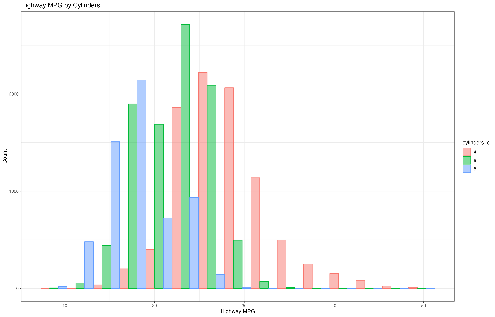
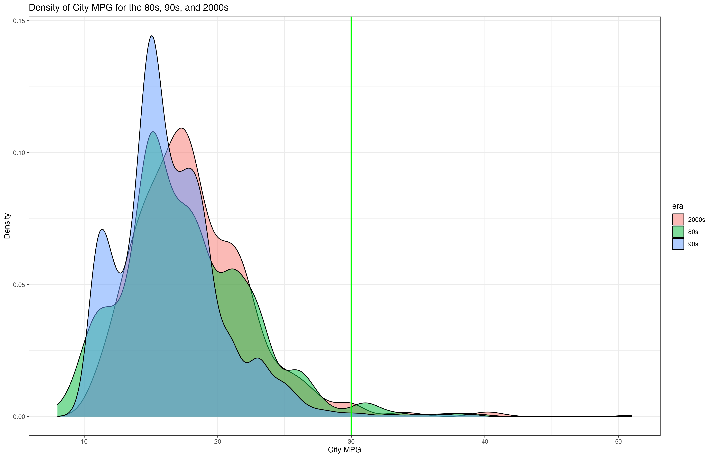
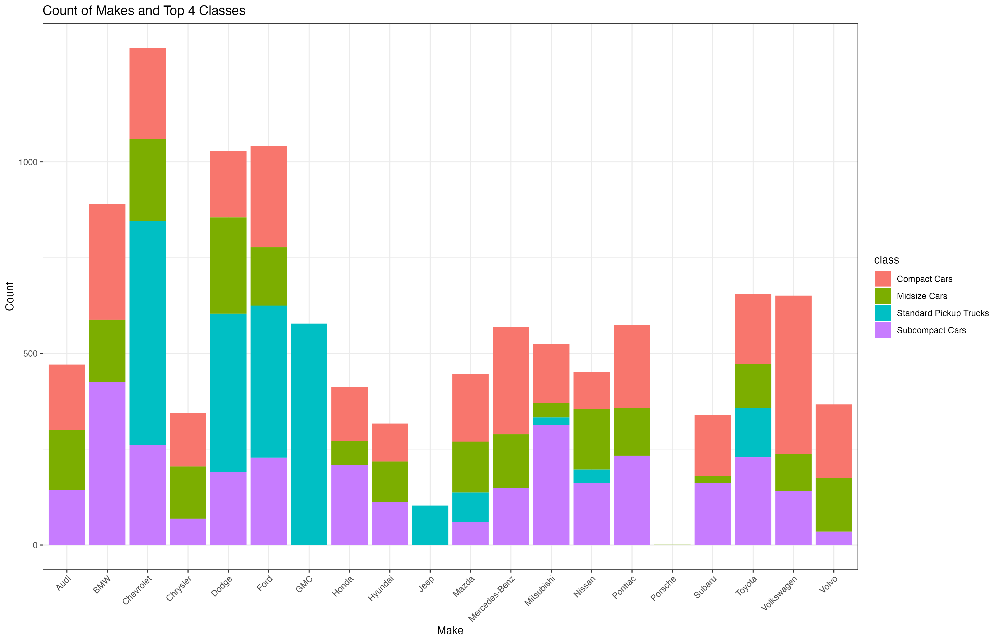
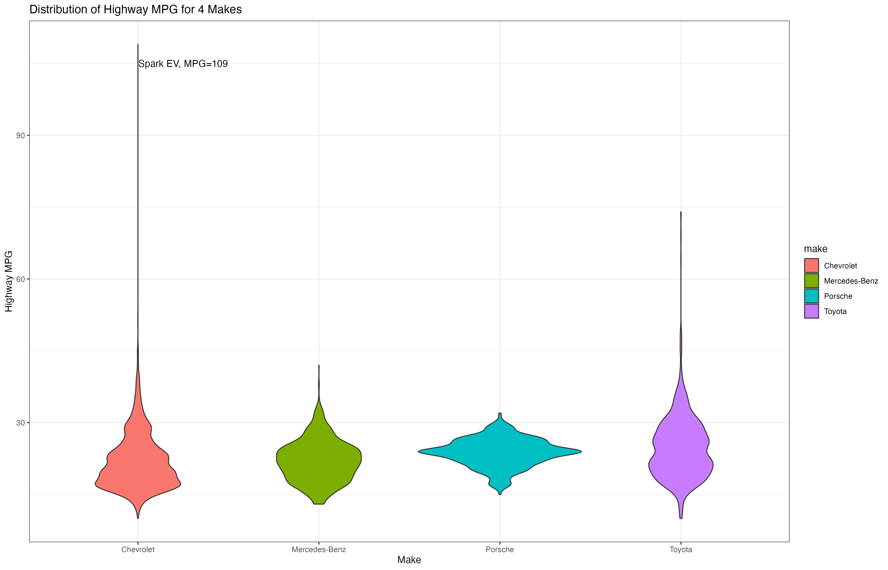
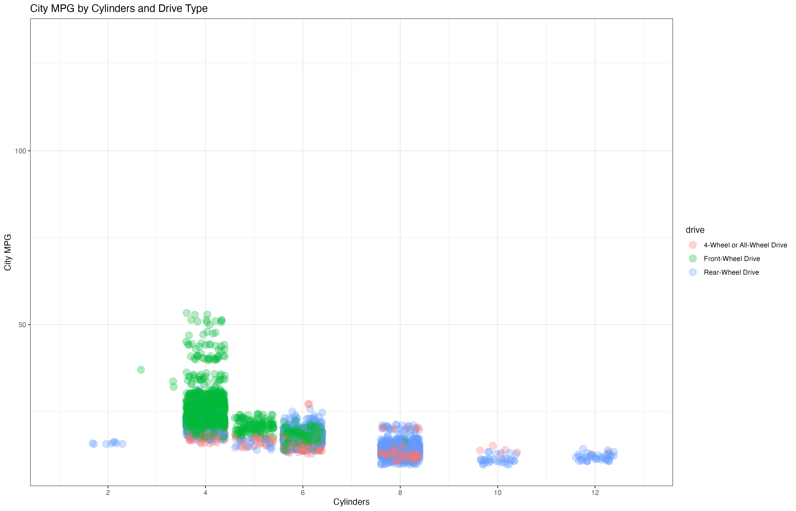
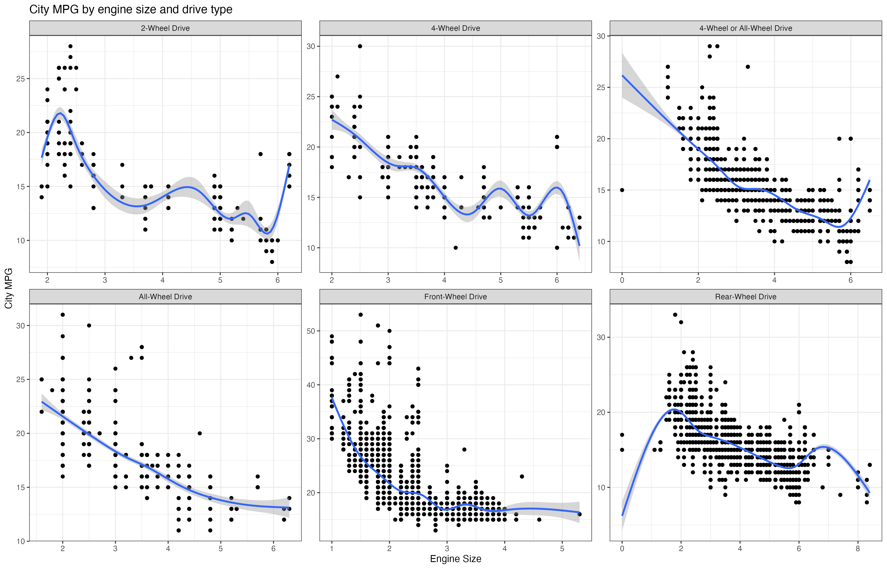
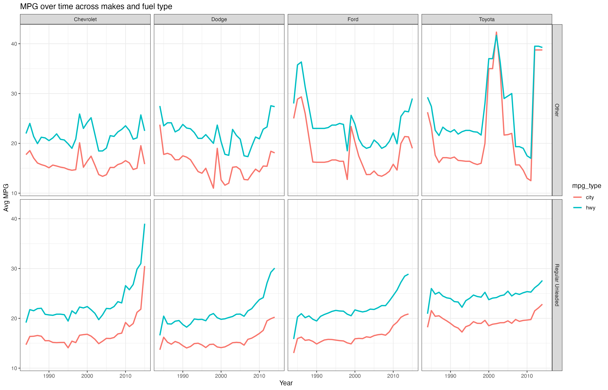

# Visualization in R

This repository contains solutions to a set of visualization problems using ggplot2, a powerful data visualization package in R. The dataset used contains a wide variety of cars and their different specifications.

## Overview

In this project, I explored basic visualization techniques using ggplot2 by solving a series of problems. Each problem involved data manipulation followed by creating a specific type of plot.

## Solution Overview

### Problem 1: Highway MPG by Cylinders

- **Data Manipulation**: Filtered the dataset to include relevant columns and created a new factor column for cylinder count.
- **Plot**: Created a histogram to visualize the distribution of highway gas mileage across different engine cylinder counts.

### Problem 2: Gas Mileage Over Time

- **Data Manipulation**: Filtered the dataset to include data from specific years and created an "era" column.
- **Plot**: Plotted the density of city MPG over time, comparing different eras.

### Problem 3: Count of Makes and Top Classes

- **Data Manipulation**: Filtered the dataset to include specific vehicle classes.
- **Plot**: Generated a bar plot to show the count of vehicle makes within selected classes.

### Problem 4: Distribution of Highway MPG for Selected Makes

- **Data Manipulation**: Filtered the dataset to include specific vehicle makes.
- **Plot**: Visualized the distribution of highway MPG for selected vehicle makes using a violin plot, with an annotation for a notable outlier.

### Problem 5: City MPG by Cylinders and Drive Type

- **Data Manipulation**: Filtered the dataset to include recent data and specific drive types.
- **Plot**: Created a scatter plot to show city MPG by cylinders and drive type, with random separation added for clarity.

### Problem 6: City MPG by Engine Size and Drive Type

- **Data Manipulation**: Filtered the dataset and selected specific columns.
- **Plot**: Plotted city MPG by engine size and drive type, with separate smoothing lines for each drive type.

### Problem 7: MPG Over Time by Make and Fuel Type

- **Data Manipulation**: Filtered the dataset and performed pivot operations to summarize MPG over time by make and fuel type.
- **Plot**: Visualized MPG over time for different fuel types and vehicle makes.

## Running the Code

To reproduce the solutions:

1. Clone this repository to your local machine.
2. Run the `visualizations.R` script in an R environment or RStudio.
3. The script will generate plots for each problem.

Feel free to explore the code and plots to understand the visualization techniques used in ggplot2.

